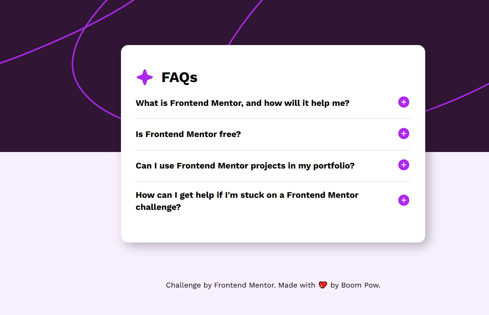

# FAQ Accordion

This is a solution to the FAQ Accordion challenge on [Frontend Mentor](https://www.frontendmentor.io). The challenge is to build a responsive FAQ accordion using HTML, CSS, and JavaScript.

## Overview

The project consists of a FAQ section that displays multiple questions in an interactive accordion layout. The design adapts to different screen sizes for optimal viewing.

### Features

- Responsive design for both mobile and desktop views.
- Interactive accordion functionality.
- Accessible and semantic markup.

### Lesson

- Implemented JavaScript for interactive UI components.
- Practiced using CSS custom properties and responsive design techniques.

### Screenshot

### Links

- Solution URL: [GitHub](https://github.com/boompow/faq-accordion)
- Live Site URL: [Vercel](https://faq-accordion-nine-iota.vercel.app/)

## Built With

- Semantic HTML5 markup
- CSS custom properties
- Flexbox
- Mobile-first workflow
- Vanilla JavaScript

## Design

The design includes:

## Colors

- Purple 50: hsl(260, 100%, 95%)
- Purple 300: hsl(264, 82%, 80%)
- Purple 500: hsl(263, 55%, 52%)

- White: hsl(0, 0%, 100%)
- Grey 100: hsl(214, 17%, 92%)
- Grey 200: hsl(0, 0%, 81%)
- Grey 400: hsl(224, 10%, 45%)
- Grey 500: hsl(217, 19%, 35%)
- Dark blue: hsl(219, 29%, 14%)
- Black: hsl(0, 0%, 7%)

## Typography

### Body Copy

- Font size (paragraph): 13px

### Fonts

- Family: [Barlow Semi Condensed](https://fonts.google.com/specimen/Barlow+Semi+Condensed)
- Weights: 500, 600

## Author

- Frontend Mentor - [@boompow](https://www.frontendmentor.io/profile/boompow)

## Acknowledgments

Designs provided by [Frontend Mentor](https://www.frontendmentor.io).

Special thanks to the Frontend Mentor community for their support and feedback.
